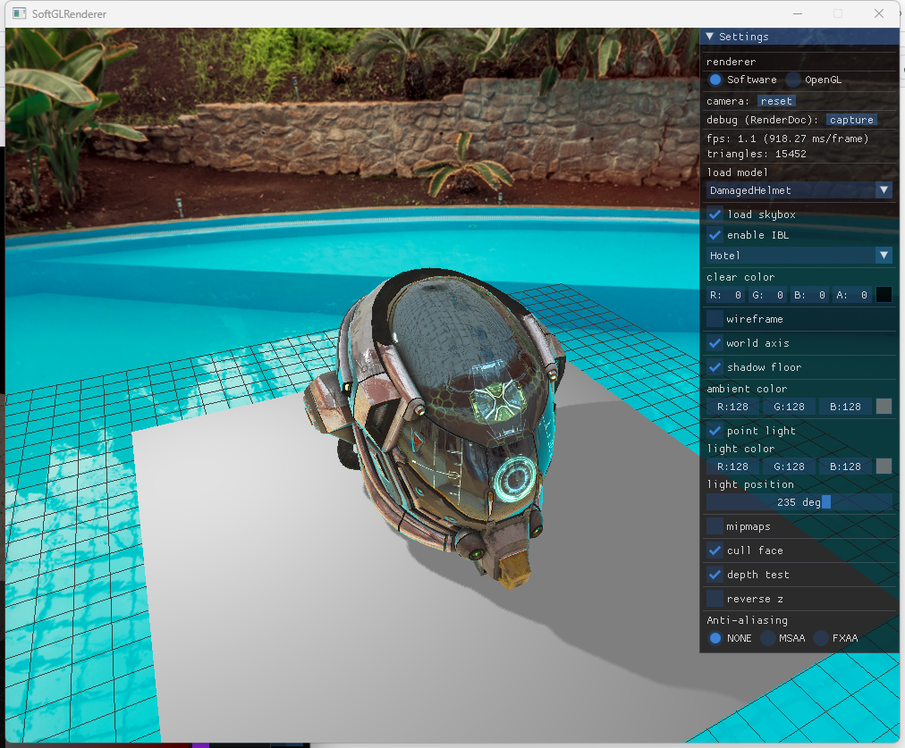
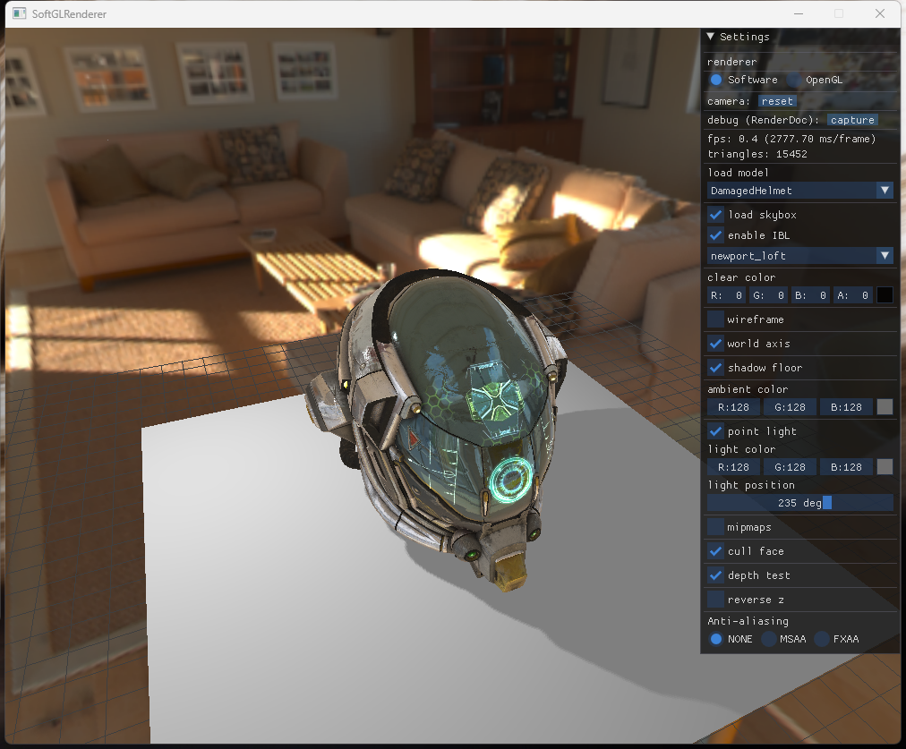
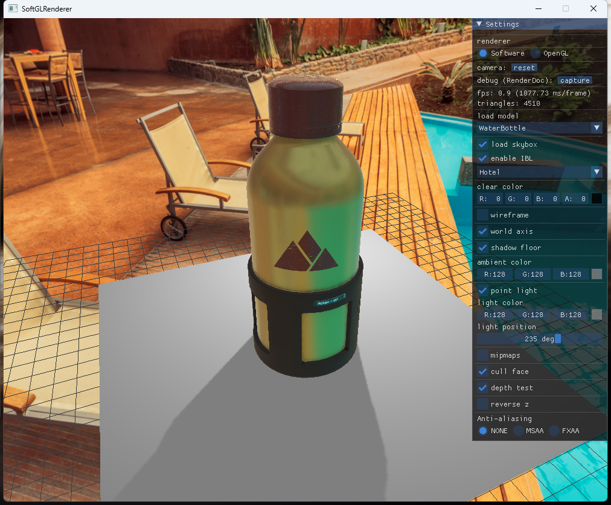
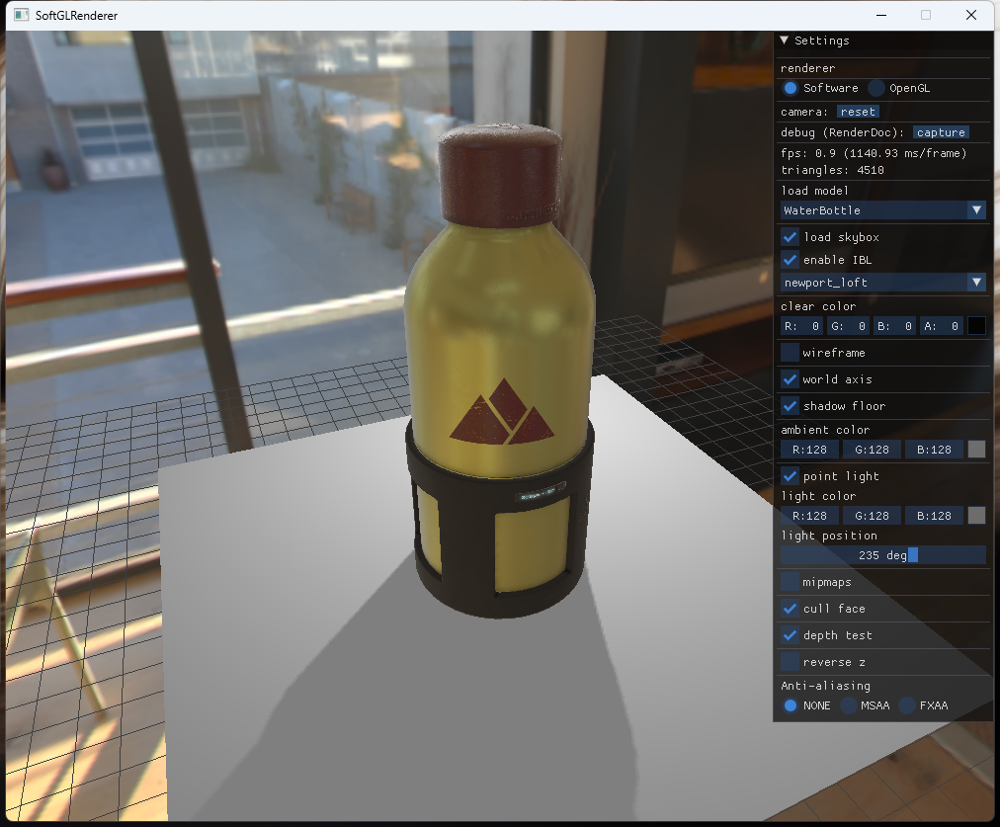
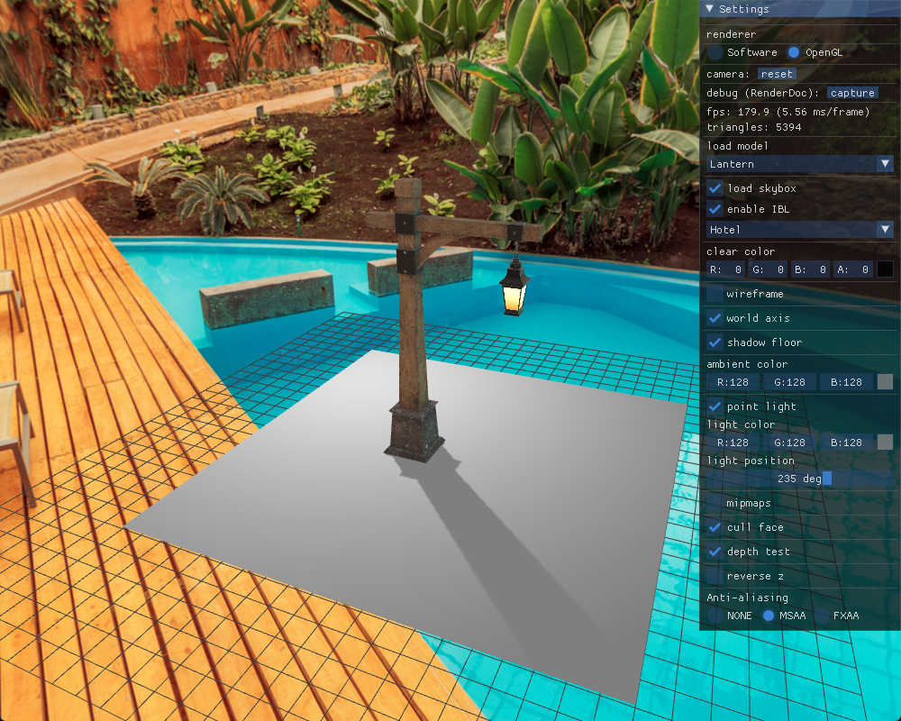
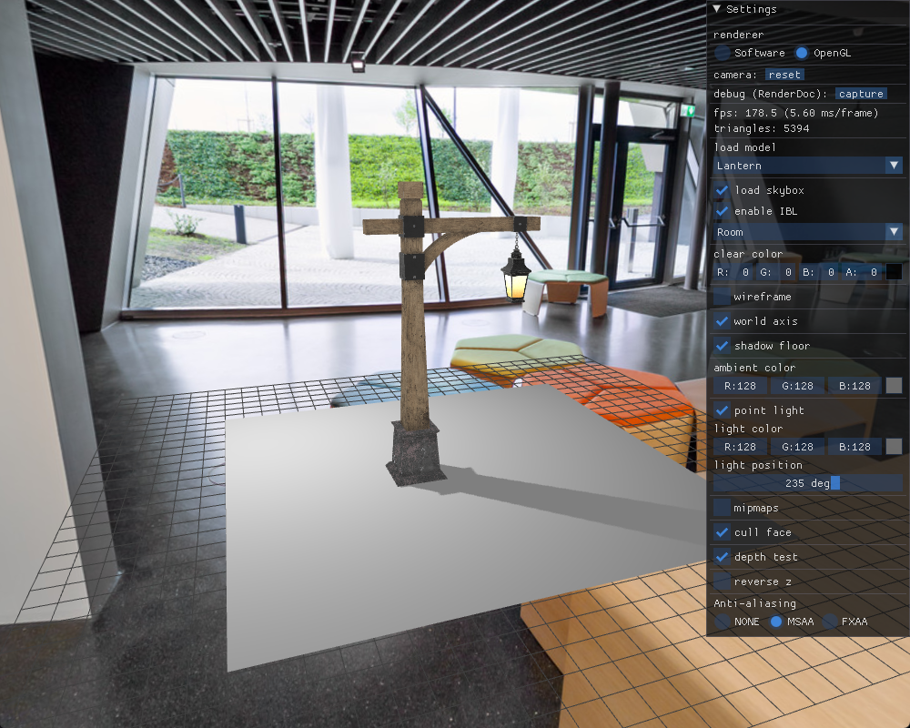
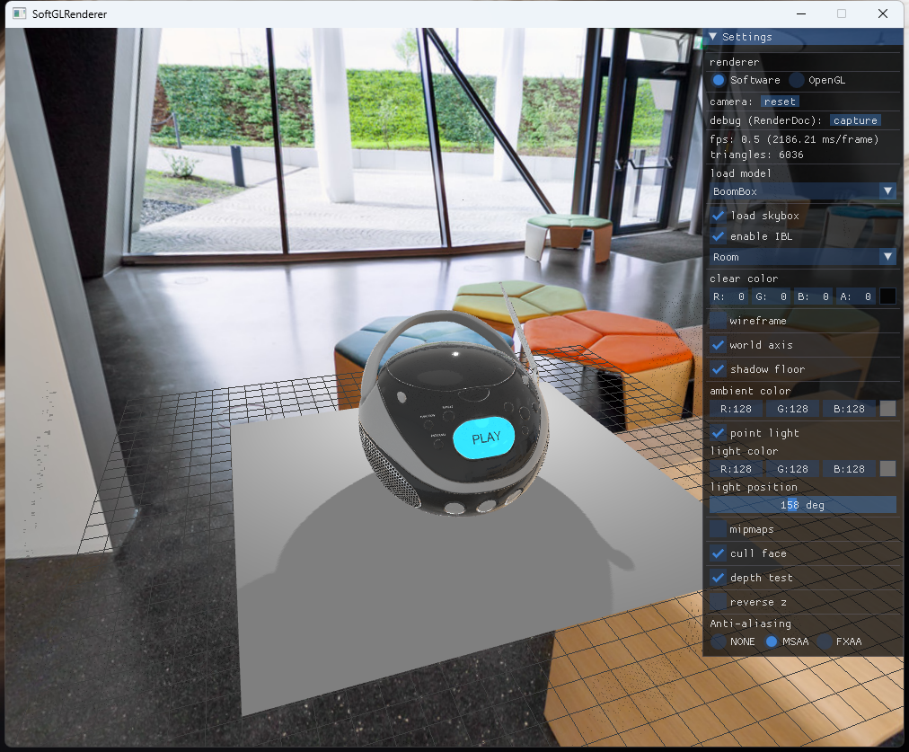
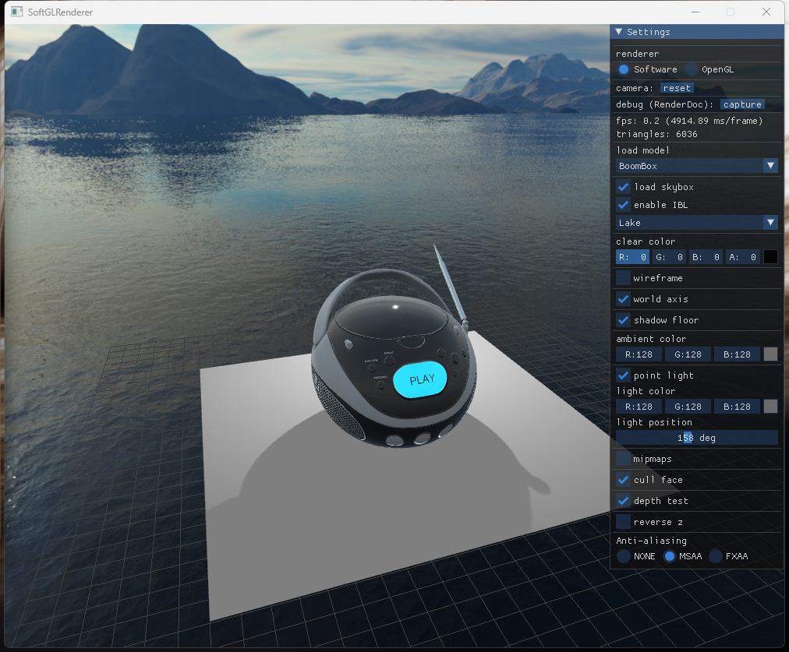
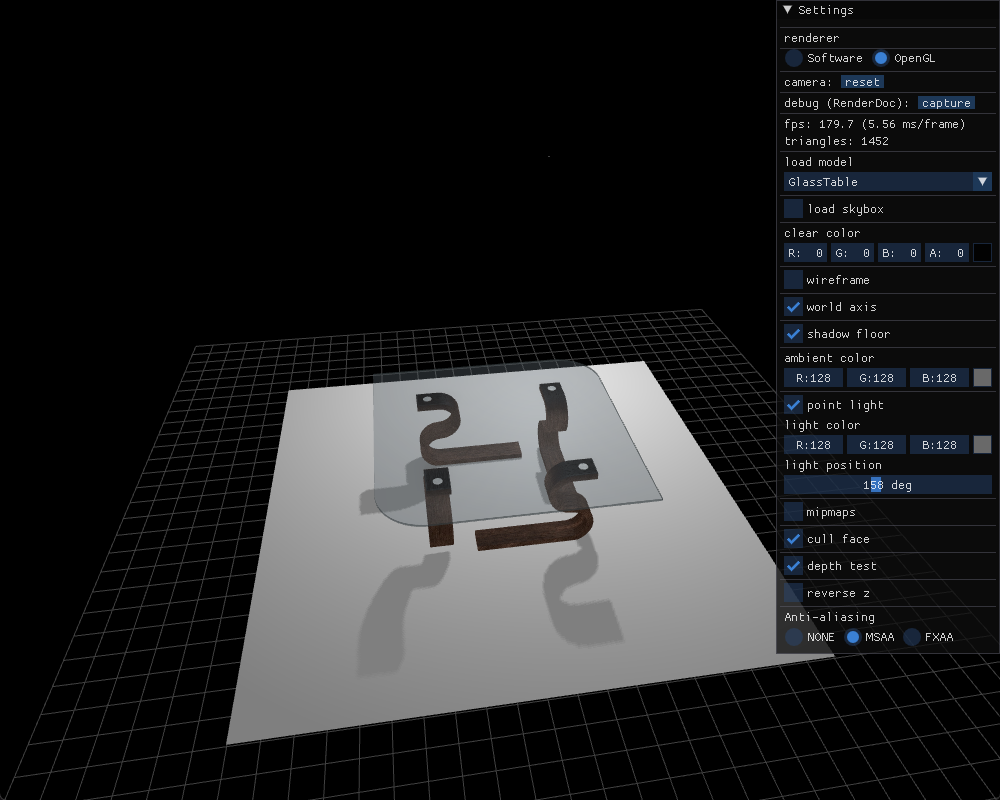
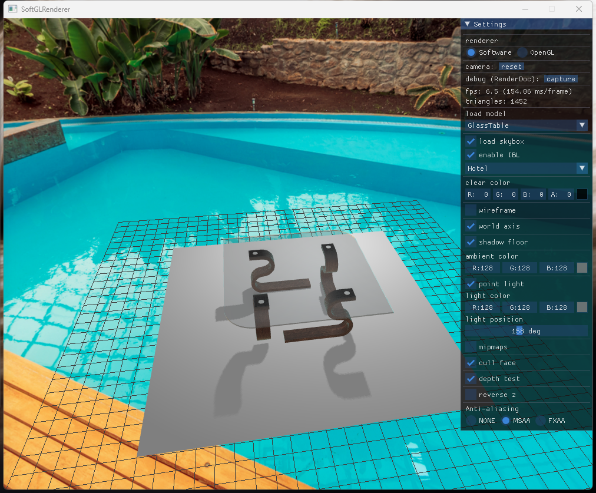

# 软件/OpenGL渲染器

该项目实现了GPU渲染管线的主要步骤，并使用C++模拟顶点着色器和片段着色器，通过Assimp加载3D模型（GLTF），并使用GLM作为数学库。项目中还添加了OpenGL渲染器的实现，可以在运行时实时切换渲染器。

## Examples

|  |  |
| :----------------------------------------------------------: | ------------------------------------------------------------ |
|  |  |
|  |  |
|  |  |
|  |  |

